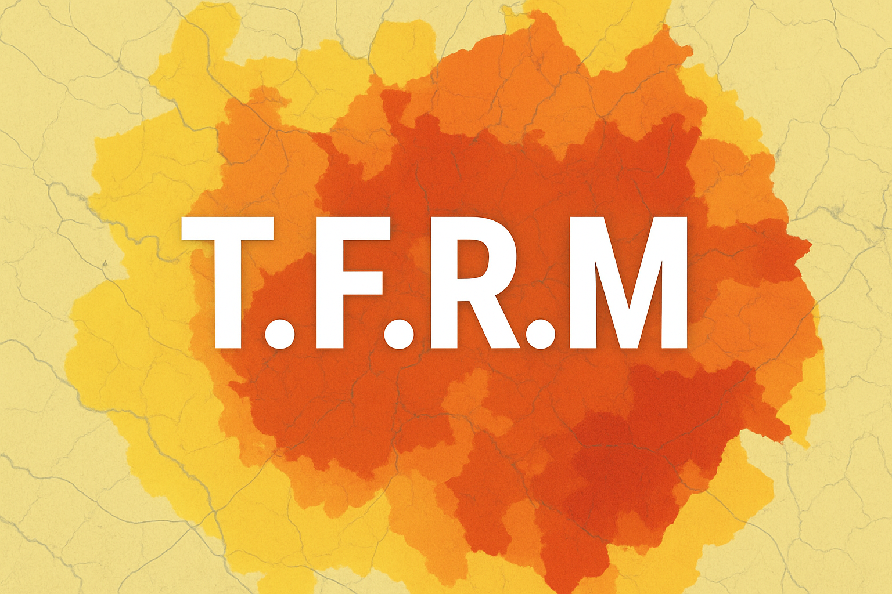
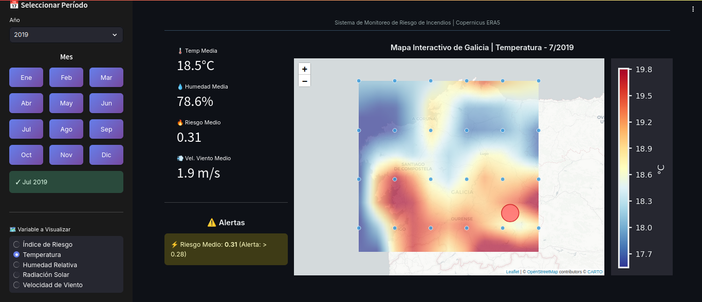
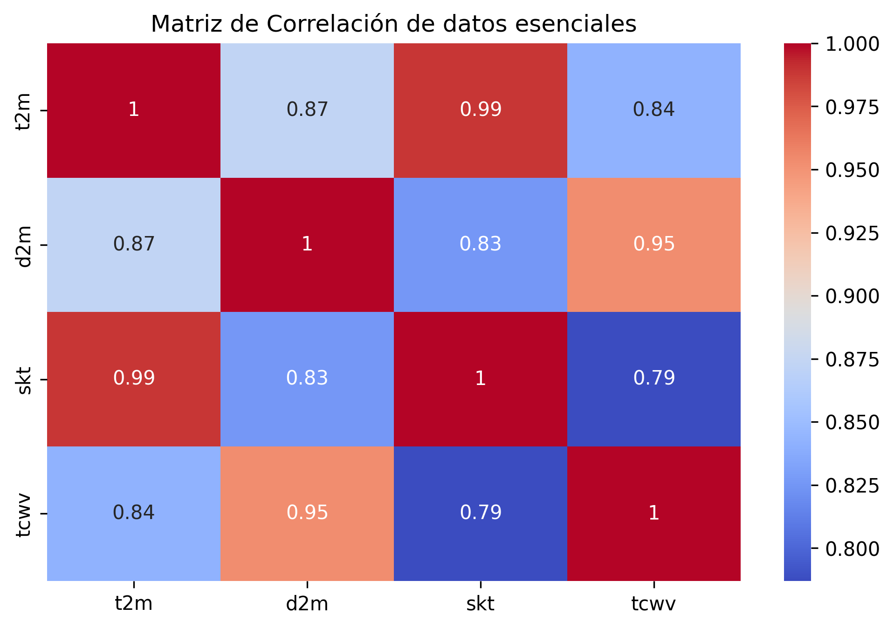

# Trinity's Fire Risk Map 🧭

Mapa comunitario interactivo para la región española de Galicia,
para prevención y sistema de alertas de incendios. 🔥

## ¿Por qué? 🤔

Como parte de nuestra solución al Reto 4 del Hackaton CoAfina 2025 "Educando a las comunidades con ciencia del cambio climático" hemos desarrollado una app de libre acceso al alcance de la población civil para monitoreo de diversas variables y métricas climáticas, así como un sistema de alerta temprana para posibles escenarios de incendios forestales.

## ¿Para quién? 🌍

### PARA TODOS❗❤️

Toda persona con un dispositivo con conexion a internet puede ser capaz de conectarse!

### Interfaz intuitiva y sencilla 🙂‍↕️



Sin ejecutar scripts, sin instalación, sin descargas 🙂‍↔️🙂‍↔️🙂‍↔️

Los datos son nuestros aliados en la prevención y lucha contra el cambio climático, si los entendemos podemos tomar acción!

Este dashboard ya es accesible por medio de la plataforma de [render.com](https://render.com/).

### Acceso al tablero implementado
https://tfrm.onrender.com/


## Datos abiertos científicamente trabajados 😎👨‍🔬

Trinity's Fire Risk Map utiliza un gran conjuntos de datos abiertos de "Copernicus Data Space Ecosystem" un programa de Observación de la Tierra de la Unión Europea, liderado por la Comisión Europea en asociación con la Agencia Espacial Europea (ESA) 🇪🇺

También se hace uso de la data histórica de [incendios en España](https://datos.civio.es/dataset/todos-los-incendios-forestales/) de civio.es


#### Trinity's Fire Map considera parametros calculados a partir de técnicas profesionales en el analisis de datos para proporcinar informacion util y confiable a los usuarios.



## Despliegue 🚀⚡

La App usas la tecnología de los contenedores Dockers para funcionar como una Docker Web App, sustentada en Streamlit para la creacion de Dashboard y graficos interactivos, mezclado con la potencia de Python y sus distintas librerias (Flask, Numpy, Xarray, Folium, Matplotlib)


<div style="display: flex; gap: 20px; justify-content: center;">
  
  
  
</div>


### Pre-requisitos
- Docker y Docker Compose instalados. [Documentacion](https://docs.docker.com/)

- Credenciales del Climate Data Store (CDS) de Copernicus.
  [Puedes configurarlo aqui!](https://cds.climate.copernicus.eu/how-to-api)
  


### Paso a Paso:

1. Clona el repositorio
```bash
git clone git@github.com:justjuanl/tfrm.git
```
2. cambia a la carpeta del repositorio (Por defecto es tfrm)
```bash
cd carpeta-repositorio/
# cd tfrm/
```
3. Modifica el contenido del archivo __.env__ añadiendo la key CDS (ejecuta "ls -a" si no ves el archivo). Reemplaza API_KEY por la clave API generada en [CDS](https://cds.climate.copernicus.eu/how-to-api)
```env
CDSAPI_KEY=API_KEY
```


4. Inicia el dashboard, desde el directorio donde se encuentra el compose.yml:

```bash
docker compose up

#usa "docker compose up -d" para el modo detached
```

5. Abre tu navegador en `http://localhost:8501`

## Colaboradores
Este proyecto es mantenido y creado por Trinity Warriors, compuesto por:
- [Manuel Arteaga](https://github.com/lxkishoxl)
- [Juan Pablo León](https://github.com/justjuanl)
- [Carlos Mora](https://github.com/cyphusx12)
- [Sebastián Sosa](https://github.com/sosalemorvan)